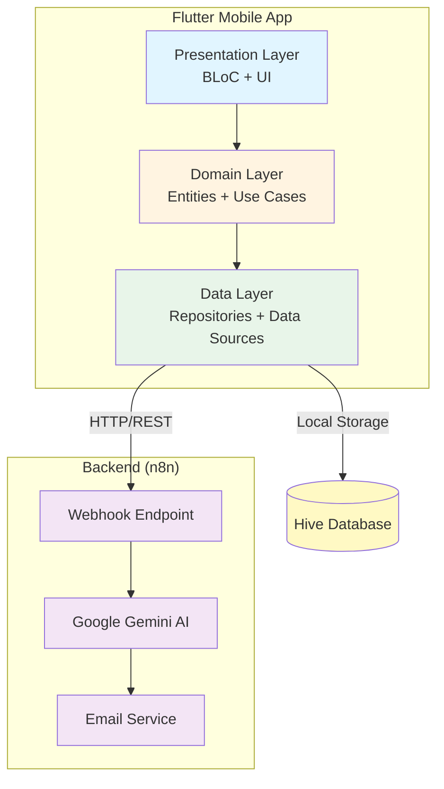

# System Architecture

## Overview

SafeGuard AI follows Clean Architecture principles with clear separation of concerns across three main layers: Presentation, Domain, and Data.

## Architecture Diagram

## Layer Responsibilities

### Presentation Layer
- **BLoC**: State management and business logic coordination
- **Pages**: UI screens and user interactions
- **Widgets**: Reusable UI components

### Domain Layer
- **Entities**: Core business objects
- **Use Cases**: Application-specific business rules
- **Repository Interfaces**: Contracts for data operations

### Data Layer
- **Repositories**: Implementation of domain interfaces
- **Data Sources**: Remote (API) and Local (Hive) data access
- **Models**: Data transfer objects and database models

## Data Flow

1. User interacts with UI (Presentation Layer)
2. BLoC processes event and calls Use Case (Domain Layer)
3. Use Case executes business logic and calls Repository (Data Layer)
4. Repository fetches data from Remote/Local Data Sources
5. Data flows back through layers to update UI

## Technology Stack

- **Frontend**: Flutter 3.10+, Dart 3.0+
- **State Management**: BLoC Pattern
- **Navigation**: GoRouter
- **Local Storage**: Hive NoSQL
- **Networking**: Dio
- **Backend**: n8n Workflow Automation
- **AI**: Google Gemini Vision API

## Design Patterns

- **Clean Architecture**: Layer separation and dependency inversion
- **Repository Pattern**: Data access abstraction
- **BLoC Pattern**: Reactive state management
- **Dependency Injection**: GetIt for service management
- **Use Case Pattern**: Business logic isolation
